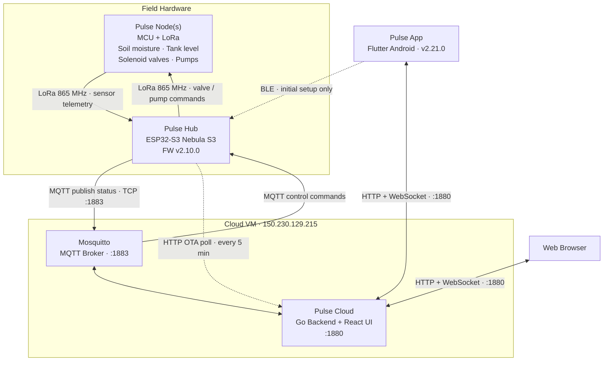
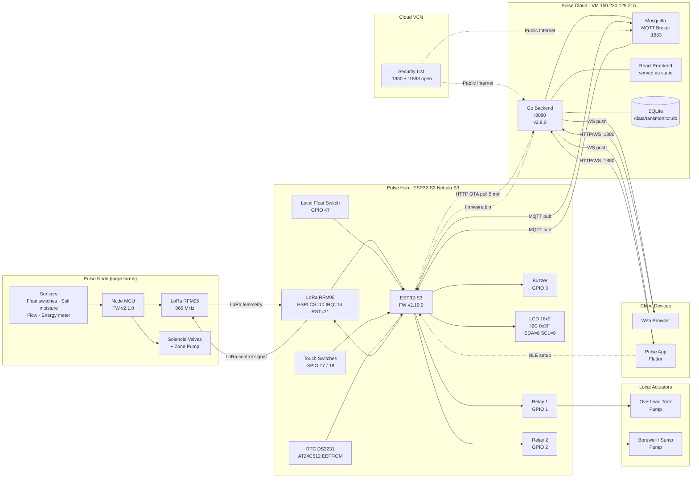

# AgriPulse

**AgriPulse** is an open-source smart agriculture automation platform that enables
intelligent farm management through IoT, automation, and real-time monitoring.

It is designed to be modular, reliable, and extensible — scaling from a single
borewell and tank on a smallholding up to multi-zone irrigation across a large farm.

## Platform Capabilities

- Smart irrigation and zone control
- Borewell and water pump automation
- Water tank level monitoring
- Soil moisture and environmental sensing
- Solenoid valve management
- Power and energy monitoring
- Remote monitoring and notifications
- Home Assistant integration
- ESP32-based distributed controllers
- LoRa, Wi-Fi, Ethernet, and 4G connectivity
- Scalable farm automation architecture

> **Project status.** **Pulse Hub** is the component under active development.
> **Pulse Cloud**, **Pulse App**, and **Pulse Node** were carried over from an
> earlier tank-monitoring project and will be redesigned for AgriPulse once the
> hub is feature-complete. Their current documentation below describes the
> system *as it runs today*, not the final design.

---

## Components

| Folder | Name | What it is |
| --- | --- | --- |
| `pulse-hub/` | **Pulse Hub** | ESP32-S3 controller in the field — the brain |
| `pulse-node/` | **Pulse Node** | Remote LoRa unit — senses, actuates, or both |
| `pulse-cloud/` | **Pulse Cloud** | Go + React server and MQTT broker on a VM |
| `pulse-app/` | **Pulse App** | Flutter mobile client |

---

## System Topology

AgriPulse keeps the proven three-tier flow:

1. **Pulse Hub** — an ESP32-S3 in the field runs all real-time logic (pumps,
   valves, level thresholds, schedules, interlocks). It keeps working
   autonomously even with no network.
2. **Pulse Cloud on a VM** — a Go backend + React UI, paired with a Mosquitto
   MQTT broker. It is the always-on remote access point, history store, and OTA
   firmware server.
3. **Pulse App** — a Flutter client talking to Pulse Cloud over HTTP/WebSocket,
   plus BLE directly to the hub for first-time provisioning.

**For large farms, LoRa carries both directions**: Pulse Nodes send sensor
readings (tank level, soil moisture, flow, power) to the hub *and* receive
control signals back from it — so valves and pumps spread across distant plots
can be driven without running Wi-Fi or cable to every zone.

---

## Architecture — High-Level Overview



> On a small installation the LoRa tier is optional — the hub drives its
> local relays and float switches directly. Pulse Nodes are added when zones are
> too far apart to wire.

---

## Architecture — Detailed



### Protocol Summary

| Link | Protocol | Port / Medium | Direction |
| --- | --- | --- | --- |
| Pulse Node ↔ Pulse Hub | LoRa 865 MHz | RF | Bidirectional (telemetry + control) |
| Pulse Hub ↔ MQTT Broker | MQTT over TCP | 1883 | Bidirectional |
| Pulse Hub → Pulse Cloud | HTTP | 1880 (OTA poll every 5 min) | Outbound |
| Pulse Cloud → Pulse Hub | HTTP | via MQTT ota_start cmd | Triggered |
| Browser / App ↔ Pulse Cloud | HTTP REST + WebSocket | 1880 | Bidirectional |
| Pulse App → Pulse Hub | BLE | RF | Setup only |
| Internet → VM | Cloud VCN Security List | 1880 / 1883 | Inbound |

> Today's Pulse Node firmware sends a one-way 4-byte `FloatPacket`. The
> bidirectional LoRa control path shown above is the AgriPulse target design and
> lands with the multi-zone hub work.

---

## Repository Structure

```text
AgriPulse/
├── pulse-hub/     ESP32-S3 hub firmware (PlatformIO + Arduino framework) — active development
├── pulse-node/    Remote LoRa node firmware — senses and/or actuates (ATmega328P)
├── pulse-cloud/   Go backend + React/Ant Design frontend (Docker-deployed on a cloud VM)
└── pulse-app/     Flutter mobile app
```

## Versions

| Component | Latest |
| --- | --- |
| Pulse Hub | v2.10.0 |
| Pulse Node | v2.1.0 |
| Pulse Cloud | v2.8.0 |
| Pulse App | v2.21.0 |

---

## Hardware

> **The deployed board is v1.0**, and the pin map below reflects it. This is what
> the default `nebulas3` / `nebulas3_serial` environments build. The v2.0 columns
> are listed alongside for reference only and are selected by the `BOARD_V2` flag
> (`nebulas3_v2` envs) — do **not** build those for this unit.

| Component | v1.0 — deployed | v2.0 — reference only |
| --- | --- | --- |
| Controller | ESP32-S3 Nebula S3 | same |
| OH Relay | GPIO 1 (RLY1 — START, emulates the starter's green button) | same |
| UG Relay | GPIO 2 (RLY2 — STOP, emulates the starter's red button) | same |
| Changeover Relay | GPIO 35 (RLY3 — selects well vs borewell contactor) | same |
| Buzzer | GPIO 3 | same |
| UG Float Switch | GPIO 42 | GPIO 47 |
| Touch Switch OH | GPIO 41 | GPIO 17 |
| Touch Switch UG | GPIO 40 | GPIO 18 |
| **I2C bus** | **SDA=18, SCL=17** | SDA=8, SCL=9 |
| I2C LCD | 16×2, auto-detected, typically 0x27 | typically 0x3F |
| RTC | DS3231 (I2C 0x68) | same |
| EEPROM | AT24C512 (I2C 0x50–0x57) | same |
| Zone valves | 8-channel I2C relay board (PCF8574 / MCP23017) | same |
| 3-phase meter | ADE7758 on FSPI (SCLK=4, MISO=5, MOSI=6, CS=48, IRQ=46) | same |
| LoRa | RFM95 on HSPI (CS=10, IRQ=14, RST=21, DIO1=8) — 865 MHz | DIO1 not wired |
| OH Tank node | ATmega328 + LoRa, float switch | same |

> On v1.0, **GPIO8 is the LoRa DIO1 line** — it is not free, and must never be
> repurposed (e.g. as an alternate I2C SDA) while the radio is running.

### Flash

Verified by reading the chip directly (`esptool flash_id` → manufacturer `c8`,
device `4017`): **8 MB**. The stock PlatformIO board file claims 4 MB, which is
wrong; `platformio.ini` overrides it. Partitions give each of two OTA slots 3 MB.

---

## Credentials & Access

### ESP32 Wi-Fi Access Point (AP mode)

When no home Wi-Fi is configured, or while the device is booting, the ESP32
broadcasts its own AP for initial setup.

| Parameter | Value |
| --- | --- |
| SSID | `AgriPulse` |
| Password | *(see private config)* |
| IP address | `192.168.4.1` |
| Config page | <http://192.168.4.1> |

> **Initial Wi-Fi setup**: Connect your phone/laptop to the `AgriPulse` AP,
> open <http://192.168.4.1> in a browser, and add your Wi-Fi SSID/password.
> The device will reboot and connect to your network.

---

### MQTT Broker (Mosquitto on the cloud VM)

| Parameter | Value |
| --- | --- |
| VM IP | `150.230.129.215` |
| Public domain | `nperiannan-nas.freemyip.com` |
| Port | `1883` (plain) |
| Username | *(see private config)* |
| Password | *(see private config)* |
| Status topic | `tm/{mac}/status` |
| Control topic | `tm/{mac}/control` |
| Logs topic | `tm/{mac}/logs` |

> Topic and credential names are inherited from the upstream project and are
> scheduled for renaming alongside the web app redesign. See
> [MQTT_PROTOCOL.md](MQTT_PROTOCOL.md) for the full message contract.

---

### Pulse Cloud

| Parameter | Value |
| --- | --- |
| URL | <http://nperiannan-nas.freemyip.com:1880> |
| Username | `admin` |
| Password | *(see private config)* |

---

### Pulse App

Install the latest APK from the [GitHub Releases](https://github.com/nperiannan/AgriPulse/releases/latest).

On first launch:

1. Enter the server URL: `http://nperiannan-nas.freemyip.com:1880`
2. Username: `admin`
3. Password: *(see private config)*

---

## Deployment — Oracle Cloud VM

### Where it runs

| Service | Host | Container name |
| --- | --- | --- |
| Pulse Cloud | `150.230.129.215:1880` → container port 8080 | `agripulse-cloud` |
| MQTT Broker | `150.230.129.215:1883` | `mosquitto` |

- **OS**: Rocky Linux 9.8 (x86_64, Oracle Always Free tier)
- **DNS**: `nperiannan-nas.freemyip.com` → `150.230.129.215` (static A record)
- **SSH**: `ssh -i ~/.ssh/"Oracle VMs"/rocky/ssh-key-2026-06-06.key hainatraj@150.230.129.215`

### VCN Security List (Oracle Cloud)

The following ingress ports are open in the VCN security list:

| Port | Protocol | Service |
| --- | --- | --- |
| 22 | TCP | SSH |
| 1880 | TCP | Pulse Cloud |
| 1883 | TCP | MQTT |

### First-time VM setup (sparse checkout — `web/` only)

Run once on the VM via SSH:

```bash
# Sparse clone — fetches objects only for pulse-cloud/
git clone --no-checkout --filter=blob:none \
  https://github.com/nperiannan/AgriPulse.git \
  /opt/AgriPulse

cd /opt/AgriPulse
git sparse-checkout init --cone
git sparse-checkout set pulse-cloud
git checkout main
```

After this the layout is `/opt/AgriPulse/pulse-cloud/{Dockerfile,backend/,frontend/,build.sh}`.
Future updates via `git pull` will download only `pulse-cloud/` changes.

### One-time migration from the old TankMonitor deployment

The deploy scripts now use `agripulse` naming throughout. If the VM still hosts
the previous `tankmonitor-*` stack, run this **once** before the first AgriPulse
deploy — otherwise `docker run` will fail with "network agripulse not found":

```bash
sudo systemctl stop docker || true          # optional: quiesce writes first
docker stop tankmonitor-web && docker rm tankmonitor-web
sudo mv /opt/tankmonitor /opt/agripulse     # keeps the existing SQLite DB
sudo mv /opt/TankMonitor /opt/AgriPulse     # or re-clone as shown above
docker network create agripulse
docker network connect agripulse mosquitto  # attach the existing broker
```

The SQLite file keeps its old name inside the volume (`/data/tankmonitor.db`), so
no data is lost by the move.

---

### Deploy / Update Pulse Cloud

SSH into the VM and run:

```bash
cd /opt/AgriPulse/pulse-cloud
bash build.sh
```

The script:

1. `git -C .. pull origin main` (pulls latest `pulse-cloud/` changes)
2. `docker build -t agripulse-cloud:<version> .`
3. Stops/removes old container and starts a fresh one with all required env vars

### Check container logs

```bash
docker logs --tail 50 agripulse-cloud
```

---

## Firmware — Flash / OTA

### Serial flash (USB, first-time or recovery)

```bash
cd pulse-hub
pio run -e nebulas3_serial -t upload   # COM7 on Windows
```

### OTA via build script (recommended)

From the `pulse-hub/` directory on Windows:

```powershell
cd pulse-hub
.\build.ps1 -Upload
```

The script builds with PlatformIO (`nebulas3` env), prompts for the device MAC address,
copies `firmware.bin` to the VM via SCP (using your SSH key), and triggers OTA via the web app API.

> **How the ESP32 picks it up:** The firmware polls `GET /api/ota/check/{mac}` on the web app
> (port 1880) every **5 minutes via HTTP** — completely independent of MQTT.  
> When a staged binary exists the web app replies `{"update": true, "url": "..."}` and the
> ESP32 downloads, flashes, and reboots automatically.  
> MQTT does **not** need to be connected for OTA to work.

### OTA via Pulse App

1. Open the app → go to **Settings tab** → **FIRMWARE UPDATE (OTA)**.
2. **Step 1**: tap **Choose firmware.bin** → pick the `.bin` file from your phone.
   An upload progress bar is shown; once complete the file size and upload time appear.
3. **Step 2**: tap **Flash Firmware** → confirm.
4. A 150-second countdown progress bar tracks the update:
   - `triggered` → `ack_received` (ESP32 confirmed) → `downloading` (flashing) → `success`
5. On success the device reboots into the new firmware.

### OTA via Pulse Cloud

1. Open <http://nperiannan-nas.freemyip.com:1880>, log in.
2. Go to **Firmware Update (OTA)** → click **Upload firmware.bin** → select the `.bin` file.
3. Click **Flash to ESP32** → confirm.
4. A 150-second progress bar tracks the update phases until `success`.

> The binary is staged on the server; the ESP32 fetches it on its next 5-minute HTTP poll
> (`/api/ota/check/{mac}`). No MQTT connection is required for the update to proceed.

---

## Pulse App — Build & Release

```bash
cd pulse-app
flutter build apk --release
# Output: build/app/outputs/flutter-apk/app-release.apk
```

Create a GitHub release with the APK attached:

```powershell
.\release.ps1 -Component pulse-app -Version X.Y.Z -Asset .\build\app\outputs\flutter-apk\app-release.apk -Notes "Description of changes"
```

---

## LCD Backlight Modes

| Mode | Behaviour |
| --- | --- |
| Auto | Off 7:00 AM – 5:30 PM (daytime), On at night |
| On | Always on |
| Off | Always off |

Configurable from the web app (Settings card) or mobile app (Settings section).

---

## Development Workflow (monorepo)

```bash
# Clone
git clone https://github.com/nperiannan/AgriPulse.git
cd AgriPulse

# Work on firmware
 cd pulse-hub && pio run ...
# Work on the cloud app
cd pulse-cloud/frontend && npm run dev     # dev server
cd pulse-cloud && docker build ...        # production

# Work on the mobile app
cd pulse-app && flutter run              # debug on device
cd pulse-app && flutter build apk ...    # release APK
```

### Commit & push

```bash
git add -A
git commit -m "component: description"
git push origin main
```

### Create a release

Use the `release.ps1` script — it enforces one release per component, annotated tags, and required assets:

```powershell
.\release.ps1 -Component pulse-cloud -Version 2.1.0 -Notes "Fixed X; Added Y"
.\release.ps1 -Component pulse-hub -Version 2.1.0 -Asset .\build\firmware.bin -Notes "Fixed Z"
.\release.ps1 -Component pulse-app -Version 2.0.1 -Asset .\build\app-release.apk -Notes "Bug fix"
.\release.ps1 -Component pulse-node -Version 2.0.1 -Asset .\build\firmware.hex -Notes "Cal fix"
```

> AgriPulse has no published releases yet. Until the first tag exists, the app's
> update check and the backend's firmware poller will simply find nothing.
