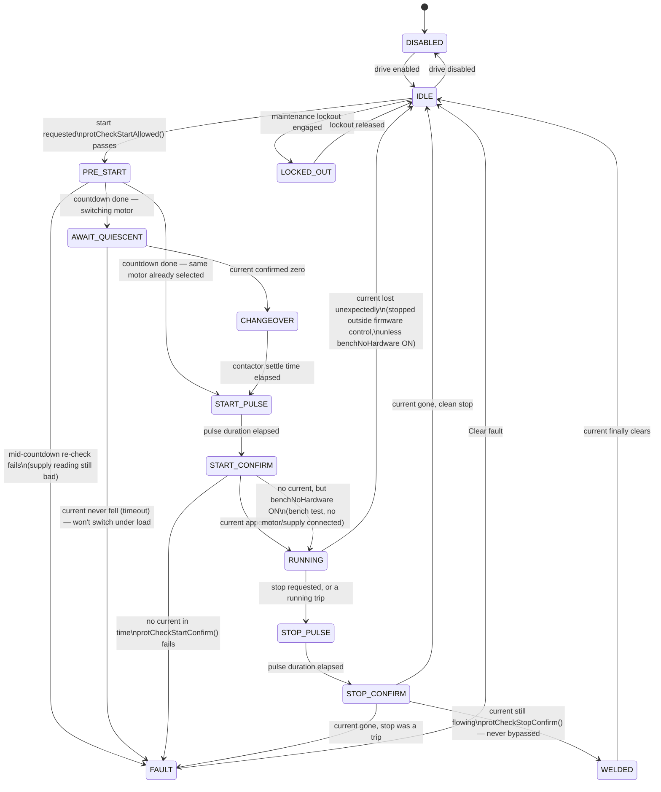
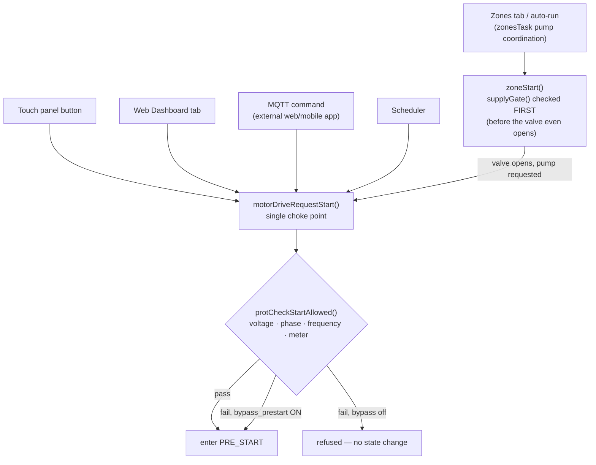

# AgriPulse — ESP32-S3 Controller Firmware

Irrigation, pump and tank-level controller built on the **Kinetic Dynamics Nebula S3** (ESP32-S3) board.

## Features

- **Motor drive state machine** — one starter (WELL/BORE via changeover contactor), driven by a single
  authoritative state machine (`MotorDrive.cpp`) that trusts measured current over relay position at
  every step. See [Controller Architecture](#controller-architecture) below.
- **Dynamic zones** — up to 32 irrigation zones across multiple I2C relay boards (PCF8574/MCP23017),
  with safety interlocks (supply gate before the valve opens, pump never deadheads, valve never closes
  on a motor still confirmed running)
- **Per-motor electrical protection** — voltage/phase/frequency (shared supply) plus independent
  current thresholds for WELL vs BORE (`MotorProtection.cpp`), with a temporary, loudly-logged
  maintenance bypass for bench testing
- **Bore routing-valve gate** — two zone relays repurposed as the bore's well/tank vs. farm routing
  valves; exactly one must be open before BORE may start
- **Irrigation programs** — scheduled watering across zones, replacing the old tank-level scheduler
- **WiFi AP+STA** — Always-on access point with background STA reconnection (priority-ordered, async
  scan, 3 attempts/SSID, 30-min cooldown)
- **Web UI** — Built-in HTTP server, real Basic Auth (not a stub), tabs for Dashboard / Zones / Scheduler
  / Protection / History / Network / System / Settings / Accounts
- **MQTT** — Publishes status to broker; subscribes to control commands; supports remote broker via
  domain name — the interface the external Go/React web app talks to
- **NTP time sync** — Auto-sync with fallback to DS3231 RTC and NVS-persisted epoch
- **OTA updates** — ArduinoOTA over WiFi (hostname `agripulse`, port 3232)
- **LoRa radio** — RFM95 on HSPI for remote tank float switch data
- **LCD display** — 16×2 I2C display, auto-detected and never confused with a relay board (declared
  I2C expansion addresses — see Network tab)
- **Buzzer alerts** — 30 s audible pre-start warning (silenceable in Settings; the delay itself never
  is) and a welded-contactor fault alarm (never silenceable)
- **History logging** — Ring-buffer event log stored in NVS, viewable in web UI

## Board Version — read this first

Two PCB revisions exist and **their pinouts differ**. This project targets the
**v1.x board**, which is the default build. The revision is selected at compile
time by the `BOARD_V2` macro, supplied by the PlatformIO environment — never
edit `Config.h` to switch boards.

| Board | Environment | Notes |
| --- | --- | --- |
| **v1.x (current target)** | `nebulas3` / `nebulas3_serial` | ESP32-S3-WROOM-1 **N16R8**, carries the ADE7758 energy meter and 3 relays |
| v2.0 | `nebulas3_v2` / `nebulas3_v2_serial` | Adds `-D BOARD_V2`; I2C, touch and float pins all move |

> **Do not enable PSRAM.** The N16R8 module's octal PSRAM occupies GPIO35–37, and
> **RLY3 (the changeover contactor) is on GPIO35**. `platformio.ini` sets
> `board_build.psram = disabled` for this reason — re-enabling it silently kills
> the changeover relay while a 3-phase motor is connected.

> **Flash:** the module has 16 MB, but `partitions/ota_dual_app.csv` currently maps
> only 4 MB (a leftover from the earlier 4 MB board). ~12 MB is unused.

## Hardware

Pin columns differ per board revision — use the column matching your build environment.

| Component | v1.x (default) | v2.0 (`BOARD_V2`) |
| --- | --- | --- |
| MCU | ESP32-S3-WROOM-1 N16R8 — 240 MHz dual-core, 320 KB RAM, 16 MB flash, PSRAM disabled | same |
| Board | Kinetic Dynamics Nebula S3 | — |
| I2C | SDA=18, SCL=17 | SDA=8, SCL=9 |
| RTC | DS3231 on I2C (0x68) | same |
| EEPROM | AT24C512 on I2C (0x50–0x57, auto-detected) | same |
| LCD | 16×2 I2C, auto-detected (0x27 / 0x3F) | same |
| LoRa | RFM95 on HSPI (MISO=12, MOSI=11, SCLK=13, CS=10, IRQ=14, RST=21) | DIO1 tied to GND |
| Relay 1 | GPIO1 — motor | same |
| Relay 2 | GPIO2 — motor | same |
| Relay 3 | GPIO35 — changeover contactor *(not yet driven by firmware)* | same |
| Energy meter | ADE7758 (3-phase) on FSPI: SCLK=4, MISO=5, MOSI=6, CS=48; IRQ→GPIO46 via optocoupler; isolated by ISO6741 | same |
| Buzzer | GPIO3 | same |
| Float switch | GPIO42 (UG tank) | GPIO47 |
| Touch buttons | OH=GPIO41, UG=GPIO40 | OH=GPIO17, UG=GPIO18 |

> Relay logic is **active-HIGH** (`RELAY_ON = HIGH`) — BC847C low-side drivers.
> The ADE7758 sits in a **mains-referenced ground domain** (`ADE_GND ≠ GND`);
> the ISO6741 and optocoupler maintain that isolation. Never bridge the grounds.

Board sources (schematic, PDF, photos) live in
[harwaredetails/esp32_4g_gateway](harwaredetails/esp32_4g_gateway). The pin
table above was extracted from that EasyEDA netlist, not read off the drawing.

## Open Items

Tracked so they are not lost between sessions.

### Blocking commissioning

| # | Item | Impact |
| --- | --- | --- |
| 1 | **CT ratio unknown** — not yet purchased | Driver stays `calibrated = false`, so **overload and dry-run trips are disarmed**. Enter the ratio to arm them. |
| 2 | **Voltage scaling defaults come from the previous board** | The 1 MΩ divider tolerance is board-specific; readings are approximate until recalibrated per unit. |
| 3 | **Bench supply currently shows phase missing / reversed sequence** | Real electrical issue, not a firmware bug — confirmed via the maintenance bypass still correctly refusing "start not confirmed" once no current follows a START pulse. Check the CT/phase wiring on the bench. |
| 4 | **Maintenance bypass (`bypass_prestart`/`bypass_running`) is currently ON** | Temporary, requested for bench testing — remove from the Protection tab once done. A page-wide red banner is up while either is active. |

> ~~Local web UI has no authentication~~ — resolved. `HttpServer.cpp` uses real HTTP Basic Auth
> (`server.authenticate()`) against the configured web login, not a stub.

### Nice to have

| # | Item |
| --- | --- |
| 5 | Obtain the original `ade7758/` Arduino library to cross-check the register map, phase-sequence logic and interrupt handling. |
| 6 | Folder is spelled `harwaredetails` (missing a `d`). Rename to `hardwaredetails` when convenient. |
| 7 | Partition table maps only 4 MB of the module's flash — double-check the actual flash size against the board (earlier notes disagree: this README says 16 MB, other notes say 8 MB). |
| 8 | `IO39–42` are the JTAG lines (`TCK/TDO/TDI/TMS`) yet v1 uses `40/41` for touch and `42` for float. Consistent with the board revision notes, but the first place to look if touch or float misbehave. |
| 9 | AP/OTA password (`agripulse`) and the web login (`admin`/`password`) are build-time defaults committed to git. Rotate them, and move the AP/OTA secret out of the repo, before deployment. |

## Build & Flash

**Prerequisites:** PlatformIO Core or PlatformIO IDE extension.

### v1.x board (default target)

```bash
pio run -e nebulas3        --target upload   # OTA over WiFi
pio run -e nebulas3_serial --target upload   # USB serial
```

### v2.0 board

```bash
pio run -e nebulas3_v2        --target upload   # OTA over WiFi
pio run -e nebulas3_v2_serial --target upload   # USB serial
```

Hold **BOOT** button during "Connecting..." if auto-reset doesn't trigger.

## Network Configuration

| Service | Default |
| --- | --- |
| AP SSID | `AgriPulse` |
| AP Password | `agripulse` |
| AP IP | `192.168.4.1` |
| Web UI | `http://agripulse.local` or `http://192.168.4.1` |
| Web UI login | `admin` / `password` — **change before deployment** |
| OTA hostname | `agripulse` |
| OTA password | `agripulse` |
| MQTT broker | `nperiannan-nas.freemyip.com:1883` |
| MQTT topic pub | `tm/{mac}/status` |
| MQTT topic sub | `tm/{mac}/control` |

## WiFi State Machine

Networks are tried in priority order (top = highest priority in web UI):

- 3 attempts per SSID, 10 s timeout each
- After all SSIDs fail: flat 30-minute cooldown before retrying (not escalating)
- Manual scans (Network tab) route through the background WiFi task rather than calling
  `WiFi.scanNetworks()` directly, avoiding a cross-core collision with reconnect scans

## Project Structure

```text
pulse-hub/
├── include/
│   ├── Config.h          # All pin/NVS-key/default constants
│   ├── MotorDrive.h      # State machine — see Controller Architecture below
│   ├── MotorProtection.h # Pure evaluator: is this safe? never drives a relay itself
│   ├── Zones.h            # Dynamic zone model + bore routing-valve gate
│   ├── ApiCommon.h        # RouteRegistrar shared by src/api/*
│   └── web/                # Embedded UI, PROGMEM raw strings, cache-busted by FW_VERSION
│       ├── PageHtml.h  PageCss.h  PageJs.h
├── src/
│   ├── main.cpp           # loop(): motorDriveTask/zonesTask/programsTask run every cycle,
│   │                      #   unconditionally — see Controller Architecture below
│   ├── MotorDrive.cpp     # The state machine itself
│   ├── MotorProtection.cpp# Voltage/phase/frequency/current evaluation, maintenance bypass
│   ├── Zones.cpp          # Dynamic zones, pump-coordination interlocks, bore valve gate
│   ├── Programs.cpp       # Irrigation scheduler (the current "Scheduler" tab)
│   ├── ValveController.cpp# Multi-board I2C relay driver (PCF8574/MCP23017)
│   ├── ADE7758.cpp        # 3-phase energy meter driver
│   ├── Buzzer.cpp         # Pre-start warning (silenceable) + fault alarm (never)
│   ├── TouchSwitch.cpp    # Physical panel buttons — one of several callers, not special
│   ├── WiFiManager.cpp    # AP+STA state machine, NTP, OTA
│   ├── HttpServer.cpp     # Web UI + REST API registration + Basic Auth
│   ├── MQTTManager.cpp    # MQTT pub/sub — what the external web/mobile app talks to
│   ├── History.cpp        # NVS event ring buffer
│   ├── api/                # One file per feature area, registered via RouteRegistrar
│   │   ├── ApiDrive.cpp ApiZones.cpp ApiProtection.cpp ApiPrograms.cpp
│   │   ├── ApiSettings.cpp ApiPower.cpp
│   ├── MotorControl.cpp   # LEGACY — retired 2026-08-07, not called from loop() anymore
│   └── Logger.cpp
├── platformio.ini    # Build environments (nebulas3, nebulas3_serial)
└── CHANGELOG.md
```

## Controller Architecture

The controller is **headless by design**: `motorDriveTask()`, `zonesTask()` and `programsTask()` run
every `loop()` cycle on Core 1 regardless of whether a browser, the touch panel, or MQTT is connected.
The embedded web UI, the physical touch panel, and MQTT (used by the external web/mobile app) are all
**equally just callers** into the same functions the scheduler itself uses — none of them own state or
decide anything. Close the browser, and irrigation still runs and the motor is still protected.

> **Keep this section current.** Whenever `MotorDrive.cpp`'s `switch(state)` changes, a new caller of
> `motorDriveRequestStart()`/`zoneStart()` is added, or the maintenance-bypass scope changes, update the
> diagrams below in the same commit — this is meant to be read instead of the source, not alongside it.

### Motor drive state machine

Every state is a real `MDRV_*` enum value from `MotorDrive.h`; every transition below is real code in
`motorDriveTask()`, not a simplification.



| State | Meaning | Left by |
| --- | --- | --- |
| `IDLE` | Nothing commanded. The only state a start can be requested from. | Start request, or Disable |
| `PRE_START` | 30 s audible warning. Always runs full length, bypass or bench mode or not. | Timer elapses, or a re-check fails |
| `AWAIT_QUIESCENT` | Waiting for current to hit zero before the changeover moves. | Current confirmed zero, or timeout |
| `CHANGEOVER` | Changeover contactor thrown, settling before the starter is pulsed. | Settle timer elapses |
| `START_PULSE` | START relay energised (latching two-wire starter). | Pulse duration elapses |
| `START_CONFIRM` | Pulse ended — watching for current to prove the starter latched. | Current appears, or confirm window times out |
| `RUNNING` | Current confirmed. Continuously re-evaluated for trips. | Stop requested, a trip, or current vanishes on its own |
| `STOP_PULSE` | STOP relay energised. | Pulse duration elapses |
| `STOP_CONFIRM` | Pulse ended — watching for current to actually vanish. | Current gone, or confirm window times out |
| `FAULT` | A precondition or confirm check failed. Needs a human to acknowledge. | **Clear fault** button (Dashboard tab) |
| `WELDED` | STOP pulsed, current never left. Contactor is physically stuck shut. | Only when current actually clears — nothing here is remote |
| `LOCKED_OUT` | Maintenance lockout engaged — refuses every start, including auto-resume. | Lockout released |
| `DISABLED` | Drive doesn't touch the relays at all. Boot default. | Enabled |

### How a start request reaches that state machine



Five independent places can ask for a start — all five go through the same one function. A check
placed in only one caller would be silently bypassable from the others.

### Maintenance bypass — what it touches, and what it never does

Three independent, deliberately-not-unified flags, each with a narrower scope than the last:

| Flag | Persisted? | What it does |
| --- | --- | --- |
| `bypass_prestart` (`ProtConfig`) | Yes (NVS) | Lets a start proceed past a failed voltage/phase/frequency/meter reading in `protCheckStartAllowed()`. |
| `bypass_running` (`ProtConfig`) | Yes (NVS) | Additionally silences over-current, dry-run, imbalance and phase-loss trips once running (`protEvaluateRunning()`). |
| `benchNoHardware` (`MotorDrive.cpp`, RAM only) | **No — always off after reboot** | Lets `MDRV_START_CONFIRM` proceed to `RUNNING` with zero real current, and keeps `MDRV_RUNNING` from immediately bouncing back to `IDLE` when it sees no current — for bench-testing the state machine with no motor or supply connected at all. |

`protCheckStopConfirm()` (did current actually vanish after the STOP pulse?) and `WELDED` detection
are never bypassed by any of the three, alone or together — with no real current ever having flowed
in the bench-mode case, stop-confirm already sees it gone immediately and succeeds on its own, so no
special case was even needed there.

**Revised 2026-08-08, twice.** First pass bypassed `MDRV_START_CONFIRM` by requiring `bypass_prestart`
AND `bypass_running` together — reusing two flags that already had a separate, legitimate, narrower
meaning (tolerate a bad *reading* during a real run). An adversarial multi-agent review the same day
found that this let a **real** start failure on a **real** motor (blown fuse, tripped overload, wiring
fault) be silently reported as a healthy `RUNNING` motor whenever both flags happened to still be set
from earlier bench testing — because nothing distinguished "bench test, nothing wired" from "real
motor, both leniencies on, genuinely failed to start." It also reached unattended scheduled starts,
not just manual sessions. Fixed by moving this behavior off `ProtConfig` entirely onto `benchNoHardware`
— a flag that structurally cannot be "left on from last week," and cannot be conflated with either of
the two real-production leniencies above.

## REST API Endpoints

Feature areas register their own routes (`src/api/*.cpp`, via `RouteRegistrar` — see `ApiCommon.h`);
every route below sits behind the same HTTP Basic Auth wrapper regardless of which module owns it.

| Method | Path | Description |
| --- | --- | --- |
| GET/POST | `/api/motor`, `/api/motor/cmd` | Drive state, precondition checklist, start/stop/lockout/enable/clearfault/setbenchmode |
| GET/POST | `/api/zones`, `/api/zones/cmd` | Zone list, run/stop/create/delete/remap, bore routing-valve config |
| GET/POST | `/api/protection` | Trip thresholds (per-motor current), maintenance bypass toggles |
| POST | `/api/calibration` | Meter scaling — what arms current-based trips |
| GET/POST | `/api/programs`, `/api/programs/cmd`, `/api/programs/save` | Irrigation scheduler |
| GET/POST | `/api/settings`, `/api/settings/cmd` | General device behaviour (buzzer countdown, etc.) |
| GET/POST | `/api/i2cexp`, `/api/i2cexp/cmd` | Declared I2C expansion board addresses |
| GET | `/api/power` | Live 3-phase readings |
| GET | `/status` | Legacy full-status JSON — still used by some UI fields and external consumers |
| GET | `/motor`, `/undergroundmotor` | Legacy relay toggle endpoints, kept for the external Go/React app; route through the same `motorDriveRequestStart()` as everything else |
| GET | `/mqttconfig` | MQTT broker, port, connection status |
| POST | `/setmqttbroker`, `/setmqttpass` | MQTT broker config |
| GET | `/wifiscan`, `/wifilist` | WiFi scan / saved networks |
| POST | `/addwifi`, `/deletewifi`, `/setwifipriority` | WiFi management |
| POST | `/setwebpass`, `/setappass` | Credentials (Accounts tab) |
| GET | `/logs`, `/history` | Log tail, event history |

## Related

- **Web App**: Go backend + React/Ant Design frontend, Docker on Oracle Cloud VM
  - URL: `http://nperiannan-nas.freemyip.com:1880` (IP: `150.230.129.215`)
- **MQTT broker**: Mosquitto on Oracle Cloud VM port 1883, externally reachable via same domain
